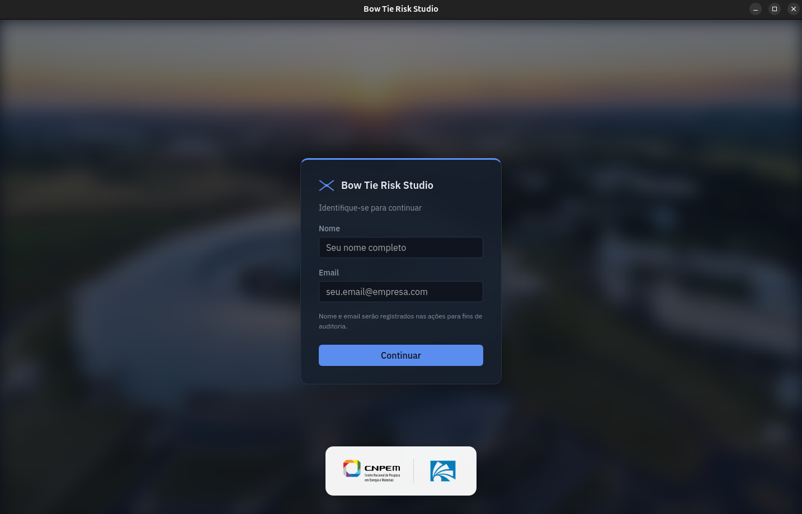
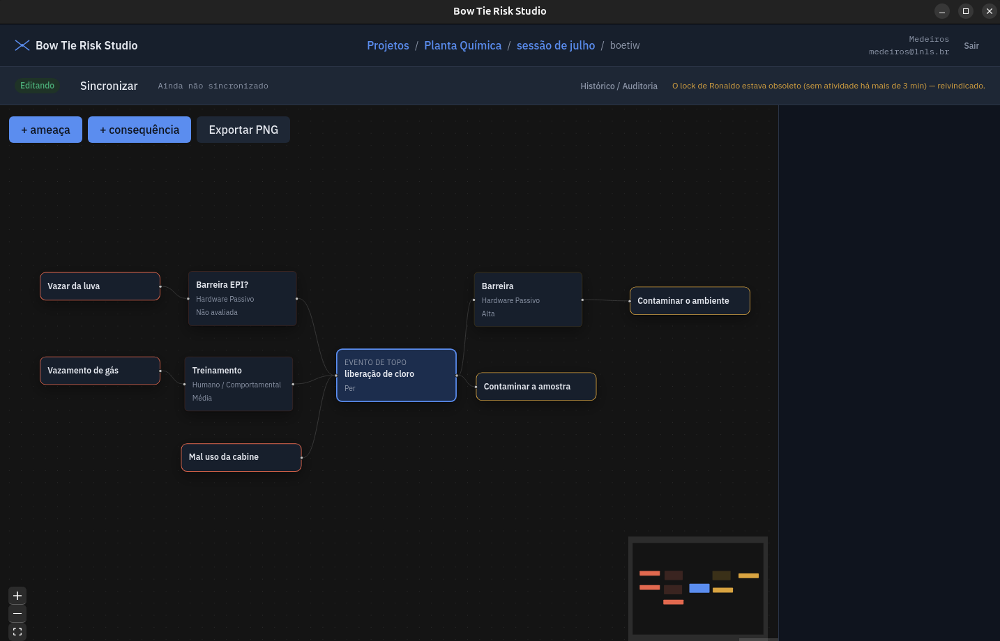

<div align="center">

# BTR Studio

### BowTieRisk Studio

Aplicação desktop, local e offline-first, para construir e gerenciar análises de risco no formato **Bow Tie** (Gravata Borboleta): ameaças e barreiras preventivas à esquerda, evento de topo no centro, consequências e barreiras mitigatórias à direita.


Ver [about.md](about.md) para a especificação completa do produto e o roadmap por fases.

</div>

---

## Capturas de tela

<p align="center">
  
  <br>
  <sub>Identificação do usuário — wallpaper com blur do Sirius/LNLS e identidade visual CNPEM/LNLS.</sub>
</p>

<p align="center">
  
  <br>
  <sub>Editor do diagrama — canvas interativo com ameaças, barreiras, evento de topo e consequências.</sub>
</p>

## Funcionalidades

- Hierarquia Projeto → Sessão → Bowtie, cada projeto salvo em um arquivo SQLite próprio.
- Canvas visual do bowtie (React Flow): layout determinístico por colunas, nós customizados por tipo, reordenar barreiras arrastando, exportação em PNG.
- Barreiras classificadas pela taxonomia CCPS/DNV-GL (Detectar-Decidir-Agir) e escala de efetividade numérica.
- Auditoria completa: toda criação, edição e exclusão é registrada com autor e data; tela de Histórico com filtros por usuário, entidade, ação e período, resumo por ação/usuário/dia e exportação em CSV.
- Sincronização segura para pastas compartilhadas (ex.: SharePoint/OneDrive): cópia de trabalho local, lock com heartbeat, backups automáticos rotacionados e checagem de integridade a cada sincronização.
- Identificação por nome e email (atribuição, não autenticação) e textos de interface centralizados em português.

## Stack

| Camada | Tecnologia |
| --- | --- |
| Runtime desktop | [Tauri 2](https://tauri.app/) (Rust) |
| Interface | [React](https://react.dev/) 19 + TypeScript + Vite |
| Dados | SQLite local via `tauri-plugin-sql`, um banco por projeto |
| Canvas | [@xyflow/react](https://reactflow.dev/) (React Flow) |
| Estado | Zustand |

## Desenvolvimento

```bash
npm install
npm run tauri dev
```

Pré-requisitos: Rust (via [rustup](https://rustup.rs/)) e as [dependências de sistema do Tauri](https://tauri.app/start/prerequisites/) para a sua plataforma.

## Build

```bash
npm run tauri build
```

Gera o executável e os instaladores para a plataforma em que o build é executado (Linux, Windows ou macOS) — não há cross-compilação automática entre plataformas.

## Autor

**Guilherme de Medeiros**
Software Engineer — Computational and Applied Mathematics @ UNICAMP — Research Collaborator at the Artificial Intelligence Lab., Recod.ai

[LinkedIn](https://www.linkedin.com/in/guilhermedemedeiros/)
