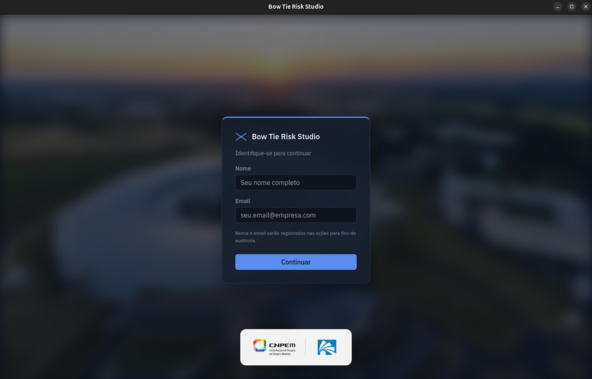
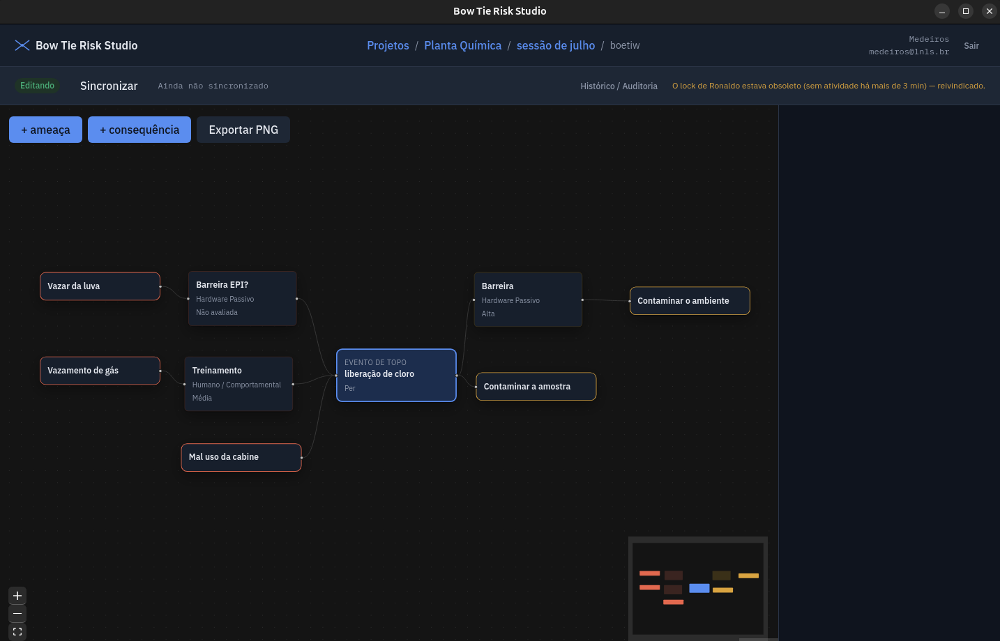

<div align="center">

# BTR Studio

### BowTieRisk Studio

Aplicação desktop, local e offline-first, para construir e gerenciar análises de risco no formato **Bow Tie** (Gravata Borboleta): ameaças e barreiras preventivas à esquerda, evento de topo no centro, consequências e barreiras mitigatórias à direita.


**[Baixar o BTR Studio](https://medeirosdev.github.io/BowTieRisk-Studio/)** · versão portátil para Windows e Linux, com manual rápido

Ver [about.md](about.md) para a especificação completa do produto e o roadmap por fases.

</div>

---

## Capturas de tela

<p align="center">
  
  <br>
  <sub>Identificação do usuário — wallpaper com blur do Sirius/LNLS e identidade visual CNPEM/LNLS.</sub>
</p>

<p align="center">
  
  <br>
  <sub>Editor do diagrama — canvas interativo com ameaças, barreiras, evento de topo e consequências.</sub>
</p>

## Funcionalidades

- Hierarquia Projeto → Sessão → Bowtie, cada projeto salvo em um arquivo SQLite próprio.
- Canvas visual do bowtie (React Flow): layout determinístico por colunas, nós customizados por tipo, reordenar barreiras arrastando.
- Exportação do bowtie em PNG, relatório em Markdown ou impressão/"Salvar como PDF" pelo diálogo nativo do sistema.
- Barreiras com nome, descrição livre, tipo e efetividade — o tipo é personalizável por projeto (taxonomia CCPS/DNV-GL de 5 tipos como ponto de partida, editável em Configurações do projeto), e a efetividade usa uma escala numérica de 1 a 5.
- Categorias de ameaças e consequências (listas separadas, personalizáveis por projeto, com cor) e filtro no canvas que esmaece as categorias ocultas.
- Aviso geral por projeto (ex.: "não alterar até a revisão"), exibido para toda a equipe com o nome de quem escreveu.
- Auditoria completa: toda criação, edição e exclusão é registrada com autor e data; tela de Histórico com filtros por usuário, entidade, ação e período, resumo por ação/usuário/dia e exportação em CSV.
- Sincronização segura para pastas compartilhadas (ex.: SharePoint/OneDrive): cópia de trabalho local, lock com heartbeat, backups automáticos rotacionados, checagem de integridade a cada sincronização e recuperação de edições não sincronizadas após uma queda. Detalhes em [sincronizacao.md](sincronizacao.md).
- Identificação por nome e email (atribuição, não autenticação), tema claro/escuro/sistema e textos de interface centralizados em português.

## Stack

| Camada | Tecnologia |
| --- | --- |
| Runtime desktop | [Tauri 2](https://tauri.app/) (Rust) |
| Interface | [React](https://react.dev/) 19 + TypeScript + Vite |
| Dados | SQLite local via `tauri-plugin-sql`, um banco por projeto |
| Canvas | [@xyflow/react](https://reactflow.dev/) (React Flow) |
| Estado | Zustand |

## Instalação

O projeto é um app Tauri: a interface roda em WebView (React + Vite), mas empacotada e distribuída como um executável nativo via Rust. Por isso, além do Node.js, é preciso ter o toolchain do Rust e as dependências de sistema do Tauri instaladas **antes** de rodar `npm install`.

### Pré-requisitos comuns (todas as plataformas)

| Ferramenta | Versão | Como instalar |
| --- | --- | --- |
| Node.js | 20.19+ ou 22.12+ | [nodejs.org](https://nodejs.org/) (LTS) |
| Rust (toolchain estável) | mais recente | [rustup.rs](https://rustup.rs/) |

Depois de instalar o Rust, confirme com:

```bash
rustc --version
cargo --version
```

### Windows

1. **Node.js**: baixe o instalador LTS em [nodejs.org](https://nodejs.org/) ou, via `winget`:
   ```powershell
   winget install OpenJS.NodeJS.LTS
   ```
2. **Rust**: baixe e rode o [`rustup-init.exe`](https://rustup.rs/) (ou `winget install Rustlang.Rustup`). Aceite o toolchain padrão — no Windows ele já vem configurado para o MSVC.
3. **Microsoft C++ Build Tools**: o toolchain MSVC do Rust depende do compilador C++ da Microsoft. Instale o [Build Tools for Visual Studio](https://visualstudio.microsoft.com/visual-cpp-build-tools/) e, no instalador, marque a carga de trabalho **"Desenvolvimento para desktop com C++"**.
4. **WebView2**: já vem pré-instalado no Windows 10 (a partir da versão 1803) e no Windows 11. Se faltar, baixe o [Evergreen Bootstrapper](https://developer.microsoft.com/microsoft-edge/webview2/) da Microsoft.
5. Clone o repositório e siga em [Rodando em desenvolvimento](#rodando-em-desenvolvimento).

### macOS

1. **Ferramentas de linha de comando do Xcode** (compilador C/C++ exigido pelo Rust):
   ```bash
   xcode-select --install
   ```
2. **Node.js**: via [nodejs.org](https://nodejs.org/) ou Homebrew:
   ```bash
   brew install node
   ```
3. **Rust**:
   ```bash
   curl --proto '=https' --tlsv1.2 -sSf https://sh.rustup.rs | sh
   ```
4. Clone o repositório e siga em [Rodando em desenvolvimento](#rodando-em-desenvolvimento).

> O build gerado localmente não é assinado nem notarizado (sem certificado de desenvolvedor Apple). Ao abrir o `.app` pela primeira vez, o Gatekeeper vai reclamar — clique com o botão direito no app → **Abrir** para liberar a exceção.

### Linux (Debian/Ubuntu)

1. **Dependências de sistema** do WebKitGTK e do empacotamento:
   ```bash
   sudo apt update
   sudo apt install -y libwebkit2gtk-4.1-dev build-essential curl wget file \
     libxdo-dev libssl-dev libayatana-appindicator3-dev librsvg2-dev
   ```
2. **Node.js**: via [nodejs.org](https://nodejs.org/), [nvm](https://github.com/nvm-sh/nvm) ou o gerenciador de pacotes da distro (se a versão empacotada atender ao mínimo acima).
3. **Rust**:
   ```bash
   curl --proto '=https' --tlsv1.2 -sSf https://sh.rustup.rs | sh
   ```
4. Clone o repositório e siga em [Rodando em desenvolvimento](#rodando-em-desenvolvimento).

Em distribuições Fedora/openSUSE (`dnf`) ou Arch (`pacman`), os nomes dos pacotes mudam (ex.: `webkit2gtk4.1-devel` no Fedora). Veja a lista completa e atualizada por distro na [documentação oficial do Tauri](https://tauri.app/start/prerequisites/).

> **Nota sobre empacotamento no Linux**: `.deb`/`.rpm` instalam o binário em `/usr/bin`, e o AppImage roda a partir de um ponto de montagem temporário — nenhum dos dois é adequado ao modelo do app, que espera as pastas `bancos/` e `backups/` ao lado do executável (pensado para ser copiado como uma pasta portátil, como no Windows). Para uso real no Linux, prefira copiar o binário puro (`src-tauri/target/release/bowtie-studio`) para uma pasta gravável e rodá-lo diretamente de lá.

### Rodando em desenvolvimento

```bash
npm install
npm run tauri dev
```

Abre o app com hot-reload da interface. Na primeira vez, o Cargo vai compilar todas as dependências Rust — pode levar alguns minutos.

### Gerando o executável (build)

```bash
npm run tauri build
```

Gera o executável e os instaladores para a plataforma em que o build é executado — não há cross-compilação automática entre plataformas (build no Windows gera `.exe`/instalador Windows, build no Linux gera `.deb`/`.rpm`/`.AppImage`, build no macOS gera `.app`/`.dmg`). Os artefatos ficam em `src-tauri/target/release/bundle/`.

Para uso real, prefira o executável puro (`npm run tauri build -- --no-bundle`, em `src-tauri/target/release/`) numa pasta gravável: o app guarda `bancos/` e `backups/` ao lado dele, o que não funciona quando instalado em "Arquivos de Programas" ou `/usr/bin`.

### Publicando uma versão

1. Atualize `version` no `package.json` (o `tauri.conf.json` lê dali).
2. Crie e envie a tag correspondente: `git tag v0.2.0 && git push origin v0.2.0`.
3. O workflow **Release** compila Windows e Linux e cria um rascunho de release com `BTR-Studio-windows-portatil.zip` e `BTR-Studio-linux-portatil.tar.gz`. Revise e publique pelo GitHub.

A página de download (`site/`) é publicada no GitHub Pages pelo workflow **Página de download** e aponta sempre para a release mais recente. Para ativar, uma vez: Settings → Pages → Source: "GitHub Actions".

## Autor

**Guilherme de Medeiros**
Software Engineer — Computational and Applied Mathematics @ UNICAMP — Research Collaborator at the Artificial Intelligence Lab., Recod.ai

[LinkedIn](https://www.linkedin.com/in/guilhermedemedeiros/)
